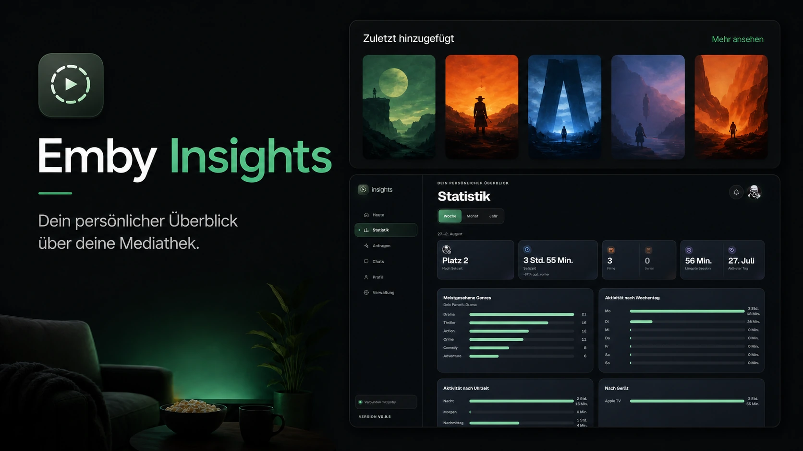

# Emby Insights



A personal, mobile-first media dashboard for Emby users. Emby Insights
complements the player instead of replacing it: personal statistics, your own
media requests, upcoming releases, and notifications all in one place.

Current release: [v0.15.5](CHANGELOG.md#0155---2026-08-09)

## Features

- Emby login with protected sessions
- Personal playback statistics: genres, weekdays, watch hours, longest
  sessions, most active days
- Detail view per title with description, cast, rating, and personal status
- Home cards: My Week, Coming Soon, Requests, New For You
- Requests page with discover lists from Seerr and TMDB
- Push notifications for new episodes, available requests, and messages
- All-in-one Docker container with backend, PostgreSQL, and Redis
- English and German UI, selectable by the admin

### What each part needs

Only Emby itself is required. Everything else is optional and switched on
individually — features whose source is missing are hidden rather than shown
broken, so a minimal install is a working install.

| To get this | You need |
| --- | --- |
| Login, home cards, watched/completed lists, detail views, ratings, watchlist, messages | An Emby server and an Emby admin API key |
| Statistics page: watch time, rank, devices, hours, weekdays, longest session, most active day | The Playback Reporting plugin (from Emby's own plugin catalogue) **and** the [Emby Insights Plugin](https://github.com/mrt187/emby-insights-plugin/releases/latest), both installed on the Emby server. Playback Reporting records the sessions; the Emby Insights Plugin exposes them per user. Without both, the Statistics page stays empty |
| Coming Soon and cinema dates for movies | Radarr |
| Air dates for series, and the next-up episode in the progress list | Sonarr |
| Regional release dates, and requesting a series straight from the calendar — Sonarr on its own only yields a TVDB id | A TMDB API key |
| Requests page, discover lists, and requesting titles | Seerr (Jellyseerr or Overseerr) |
| IMDb and Rotten Tomatoes ratings on the detail screen | An OMDb API key |
| Genre breakdown by plays, unfinished titles, transcode share, household watchers | Tracearr |
| Push notifications | A VAPID keypair in the environment (see below) |

Emby's address and admin key, plus the VAPID keys, are set in the environment.
Everything else — which services are enabled, their addresses and keys, and the
library selection — is configured in the admin UI after the first login. The
first Emby account to log in successfully becomes the administrator.

## Installation

Create a directory, put both files below in it, fill in `.env`, then start:

```bash
docker compose up -d
```

The UI is then at `http://your-host:8081`.

### `docker-compose.yml`

```yaml
name: emby-insights

services:
  emby-insights:
    image: ${EMBY_INSIGHTS_IMAGE:?set EMBY_INSIGHTS_IMAGE in .env}
    pull_policy: always
    container_name: emby-insights
    restart: unless-stopped
    env_file:
      - .env
    ports:
      - "${EMBY_INSIGHTS_PORT:-8081}:8080"
    volumes:
      - ./config:/config
```

### `.env`

```ini
EMBY_INSIGHTS_IMAGE=ghcr.io/mrt187/emby-insights:latest
EMBY_INSIGHTS_PORT=8081
LISTEN_ADDRESS=:8080

# Own long value. Do not change it after the first start.
POSTGRES_PASSWORD=change-me
# Generate with: openssl rand -base64 32
APP_ENCRYPTION_KEY=

EMBY_BASE_URL=http://your-emby-host:8096/emby
EMBY_ADMIN_API_KEY=replace-with-an-Emby-admin-api-key

# false only when accessed over plain HTTP without TLS.
COOKIE_SECURE=true
#TRUSTED_PROXIES=

# Generate once with: npx web-push generate-vapid-keys
VAPID_PUBLIC_KEY=
VAPID_PRIVATE_KEY=
VAPID_SUBJECT=mailto:you@example.com

#PUSH_POLL_INTERVAL=20m
```

What each variable means, and why the keys must stay stable:
[docker/all-in-one/README.md](docker/all-in-one/README.md).

### Health checks

Inside the container the API listens on port `8080`:

- `GET /healthz` — the process is running
- `GET /readyz` — PostgreSQL and Redis are reachable

Emby passwords are never stored. After login only the temporary Emby access
token lives in Redis. The Emby device ID is generated on first start and kept
in PostgreSQL.

## License

[MIT](LICENSE).

## Development note

This project was built with AI-assisted programming tools.
