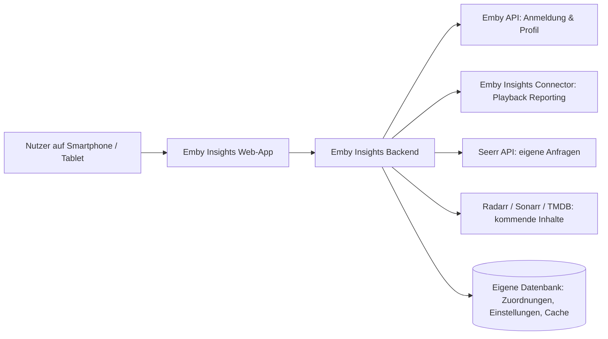

# Architektur — Emby Insights

## Leitidee

Der Browser spricht ausschließlich mit dem Emby-Insights-Backend. API-Schlüssel für Emby und Seerr verbleiben serverseitig. Jede Abfrage wird anhand der angemeldeten Emby-Identität autorisiert.

## Technischer Stack

- **Frontend:** Next.js / React
- **Backend:** Go
- **Datenbank:** PostgreSQL
- **Cache und spätere Hintergrundaufgaben:** Redis

## Authentifizierung

Nutzer melden sich mit ihren normalen Emby-Zugangsdaten an. Das Backend prüft diese gegen Emby und erstellt anschließend eine eigene, kurzlebige, sichere Sitzung für Emby Insights.

Wichtig: Das ist zunächst **kein automatisches Single Sign-on**. Eine bereits bestehende Emby-Browser-Sitzung kann nur genutzt werden, wenn Emby dafür einen geeigneten, sicher zugänglichen Authentifizierungsfluss bereitstellt. Für v0.1 ist „einmal mit Emby anmelden“ der verlässliche Ablauf.

Emby-Passwörter werden nicht gespeichert.

## Nutzerzuordnung

Die Emby-User-ID ist die führende Identität. Eine lokale Tabelle verbindet sie dauerhaft mit den IDs der anderen Quellen:

| Feld | Zweck |
| --- | --- |
| emby_user_id | Autoritative Nutzeridentität |
| seerr_user_id | Anfragen-Quelle |
| display_name | lokale Darstellung / Fallback |

Die Emby-User-ID wird für persönliche Statistikdaten direkt verwendet. Seerr wird zuerst über seine stabile Emby-ID-Verknüpfung zugeordnet; ein Benutzernamen-Abgleich bleibt nur ein Fallback. Der Admin kann abweichende Zuordnungen in Version 1 über die `.env`-Konfiguration überschreiben.

Weichen Nutzernamen zwischen den Diensten ab, werden die Zuordnungen in Version 1 manuell über die `.env`-Konfiguration überschrieben.

## Datenverantwortung

| Quelle | Bleibt verantwortlich für |
| --- | --- |
| Emby | Benutzeridentität, Avatar, Bibliotheksbezug, Wiedergabestatus, Genre und Serienabschluss |
| Playback Reporting | Persönliche Wiedergabe-Historie und Sehzeit |
| Emby Insights Connector | Sicherer, schreibgeschützter Zugriff auf Playback-Reporting-Daten und Emby-Ereignisse |
| Seerr | Request-Status und angefragte Titel |
| Radarr, Sonarr, TMDB | Veröffentlichungs- und Verfügbarkeitsdaten |
| Emby Insights | Mapping, UI-Einstellungen, Feed-Zusammenfassung, kurzlebiger Cache |

Emby Insights repliziert keine fremden Rohdatenbanktabellen. Es normalisiert API-Antworten nur für die Darstellung und cachet teure Abfragen zeitlich begrenzt.

## Backend-Schnittstelle (erste Form)

- `POST /api/auth/emby/login` — Emby-Anmeldung, Sitzung erstellen
- `POST /api/auth/logout` — Sitzung beenden
- `GET /api/me` — Profil und sichtbare Module
- `GET /api/home` — aggregierte Daten für die Home-Ansicht
- `GET /api/stats?period=week|month|year` — persönliche Statistik
- `GET /api/requests` — eigene Seerr-Anfragen
- `GET /api/upcoming` — persönliche kommende Inhalte
- `GET /api/feed` — persönliche Ereignisse

Die User-ID wird nie vom Client als Berechtigungsparameter akzeptiert; das Backend leitet sie ausschließlich aus der Sitzung ab.

## Deployment-Ziel

Emby Insights wird als einzelner Unraid-Container ausgeliefert. Der Container enthält die App, PostgreSQL und Redis; die PostgreSQL-Daten liegen in einem persistenten Volume.

- **PostgreSQL** speichert dauerhafte Daten: Nutzerzuordnungen, Benachrichtigungen und Lesestatus.
- **Redis** dient als Cache für externe Datenquellen sowie später für Hintergrund-Jobs und Synchronisationssperren.

Änderungen sollen im geöffneten Dashboard nahezu sofort erscheinen. Deshalb werden Ereignis- oder Webhook-Schnittstellen den reinen Intervallabfragen vorgezogen; die konkret verfügbaren Schnittstellen von Emby, Seerr, Radarr und Sonarr werden vor der Umsetzung geprüft.

Die Basis-URLs und geheimen Token für Emby, Radarr, Sonarr, TMDB und Seerr werden serverseitig über eine `.env`-Datei konfiguriert und nie an den Browser übertragen.

Die geprüften Datenquellen, Endpunkte und noch erforderlichen Live-Tests stehen in `docs/INTEGRATIONS.md`.
